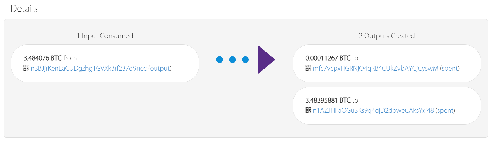

# 区块链第三次实验报告

<div style="text-align: right; font-size: 17px;">
姓名：陆皓喆  学号：2211044  专业：信息安全
</br>
姓名：张泽睿  学号：2213873  专业：信息安全
</div>

## 实验目的
本次实验的目的是实现Alice和Bob双方的**跨链原子交换(Atomic Cross-Chain Swap)的关键部分**。在这个过程中，Alice和Bob将在不同的区块链上安全地交换加密货币的所有权。

Alice在BTC Testnet3上有比特币，而Bob在BCY Testnet上拥有比特币。他们希望安全地交换各自coin的所有权，这是一个简单交易无法完成的事情，因为它们位于不同的区块链上。 
实验的核心是围绕一个只有一方(Alice)知道的秘密x建立交易。在这些事务中，只有H（x）将被发布，而x为秘密。交易将以这样的方式建立，一旦x被揭露，双方都可以赎回对方发送的硬币。如果x永远不会被揭露，双方将能够安全地取回他们的原始硬币，而不需要另一方的帮助。 


## 实验原理

跨链原子交换（Atomic Cross-Chain Exchange, ACCE）是一种去中心化的技术，允许不同区块链之间进行直接的资产交换，且不需要通过第三方中介（例如交易所）。这一过程依赖于哈希时间锁定合约（HTLC），能够确保交易的安全性和原子性，即交易要么完全成功，要么完全失败。

#### 跨链原子交换的关键要素

1. **原子性（Atomicity）**  
   跨链原子交换的“原子性”确保了交易要么完全成功，要么完全失败。如果交易的任何一方未能按照预定的条件履行合同，整个交易会回滚，避免了部分交易的情况。这是通过哈希时间锁定合约（HTLC）来实现的。

2. **去中心化（Decentralization）**  
   跨链原子交换不依赖于任何第三方机构或中介来完成资产交换，这意味着没有单一的控制方。通过智能合约实现资产的自动交换，参与者之间直接进行交易。

3. **多链支持（Multi-Chain Support）**  
   跨链原子交换允许不同区块链之间进行资产交换，如比特币与以太坊、比特币与其他区块链资产之间的互换。无论资产位于哪条区块链上，用户都能够直接交换。

4. **哈希时间锁定合约（HTLC）**  
   哈希时间锁定合约（HTLC）是实现跨链原子交换的核心。HTLC是一种智能合约，它使用哈希函数和时间锁定机制来确保交换的双方都能够信任对方履行协议。

#### 跨链原子交换的工作原理

跨链原子交换的基本工作流程依赖于哈希时间锁定合约（HTLC）。以下是详细步骤：

##### 步骤 1: 创建哈希锁定合约
- 交易的双方（例如，Alice和Bob）首先确定一个共享的哈希值（哈希函数的输出），这个哈希值用于加密秘密（preimage）。
- 其中一方（例如，Alice）会生成一个随机的“秘密”（preimage），并对其进行哈希处理，得到哈希值。这一哈希值将被用作交易中的哈希锁定条件。

##### 步骤 2: 启动交易
- Alice首先在她的区块链上创建一个HTLC，并将哈希值发布在交易中。HTLC会要求Bob提供该秘密才能解锁资金。
- Bob在自己的区块链上也创建一个HTLC，并设置相应的时间锁和条件。
- 这时，交易被创建并记录在区块链上。

##### 步骤 3: 提供秘密并完成交换
- Alice将秘密（preimage）透露给Bob。Bob使用这个秘密来解锁Alice创建的HTLC，并完成交换。
- 一旦Bob解锁Alice的HTLC并成功完成交换，Alice也就能够解锁Bob的HTLC，完成她的部分交易。

##### 步骤 4: 交易完成或回滚
- 如果在规定的时间内，Bob没有完成交易，Alice的资金会被退还。
- 如果在规定的时间内，Alice没有履行协议，Bob的资金也会被退还。

#### 跨链原子交换的应用场景

1. **去中心化交易所（DEX）**  
   跨链原子交换使得去中心化交易所成为可能，用户可以在不同区块链之间直接进行资产交换，避免了传统交易所的中心化风险和高昂费用。

2. **资产互换**  
   通过跨链原子交换，用户可以在不同区块链之间交换代币或其他数字资产，这大大增强了资产的流动性。例如，用户可以在比特币和以太坊之间交换代币，而不需要依赖第三方。

3. **跨链金融应用**  
   跨链原子交换为各种去中心化金融（DeFi）应用提供了可能，支持不同区块链的资产互通，促进了去中心化借贷、支付等应用的开发。


## 实验过程

### 创建BTC账户并领取测试币

- 运行keygen.py即可得到私钥和公钥

  ```makefile
  Alice:
  	Private key: cW3fxHAhp5RRfDcFkbctRPymyYJZe3AEF7UngN8qfnKhkPnccKNj
  	Address: mfc7vcpxHGRNjQ4qRB4CUkZvbAYCjCyswM
  	
  Bob:
  	Private key: cTuLwu7GguKL8Y1BVUH8Tmf7VbuWiJcYPGps4VUDrMLt495dyFTx
  	Address: n4mm4Rm1v3iYHdzjf8tNjAeGgJqkYqa6Fp
  ```


- 在网站 https://coinfaucet.eu/en/btc-testnet/ 输入 Alice 的 Address 即可领取 BTC ，如下所示：

  ```makefile
  Txid:[6a1c1c4257890d699b47685053744bf0db805bd19e96f3d4930bba74de89ec1d]
  ```

  交易查询如下：

  
### 创建BCY账户并领取测试币

- 在 `Blockcypher`  注册帐户，获取 `API token`

  Alice 的 token 如下：

  

  Bob 的 token 如下：

  

  

- 使用指令 `curl -X POST https://api.blockcypher.com/v1/bcy/test/addrs -d 'token=d575d69329cf42d6ba26be47883dc2cf'`创建  BCY  密钥：

  ````makefile
  {
    "private": "06f504114d5bdecf6d67f5a4c9a3d2ef7a55daca4d14f27cded40f4c004ad9c7",
    "public": "0249c0d69594198fa3273ab18ea7e8c4e227129c12d0f3b66087ab9e2607a07ee4",
    "address": "C5dBSTc1h8ScB4mFoxzShMjmAw7ESe9xmK",
    "wif": "BoZZ7SccwVnhMnTvnPsBm6jRckFRBVFBPcBaAFyMjuEsiQcgmUCP"
  }
  ````

  并填入 `keys.py`  中。

- 使用指令 
	
	```makefile
	curl -d '{"address":"C5dBSTc1h8ScB4mFoxzShMjmAw7ESe9xmK", "amount": 1000000}' https://api.blockcypher.com/v1/bcy/test/faucet?token=d575d69329cf42d6ba26be47883dc2cf
	```
	
	领取测试币，得到`tx_ref` 如下：

	```makefile
	{
	  "tx_ref": "3ebac73d2ad92458ec1b885026fb896db4856621192a59867fd34e2ee899b946"
	}
	```


### 将 BTC 和 BCY 划分为十份

#### 划分 BTC 

填入 Alice 的信息，运行 `split_test_coins.py` 

**交易输出如下：**

```makefile
201 Created
{
  "tx": {
    "block_height": -1,
    "block_index": -1,
    "hash": "b95bbc0006084b3edb5d87f55bd05b3696c5d34ca7f7ba74426219d5ebe24615",
    "addresses": [
      "mfc7vcpxHGRNjQ4qRB4CUkZvbAYCjCyswM"
    ],
    "total": 10000,
    "fees": 1267,
    "size": 497,
    "vsize": 497,
    "preference": "low",
    "relayed_by": "60.29.153.8",
    "received": "2024-10-04T01:33:13.270174753Z",
    "ver": 1,
    "double_spend": false,
    "vin_sz": 1,
    "vout_sz": 10,
    "confirmations": 0,
    "inputs": [
      {
        "prev_hash": "6a1c1c4257890d699b47685053744bf0db805bd19e96f3d4930bba74de89ec1d",
        "output_index": 0,
        "script": "47304402201c17a39d6d828a07c001923f0295d44ff0d0412748dc04b361427a3ab5bfb3290220559695c1cee8c01c1e09e0c6eb33944e4da153d0ba9c2e3eb22b5584cac8f1ab012103019c64252a509d87deb3ac2592c017b5237d7b49b4b96d75845a9a0253740fd2",
        "output_value": 11267,
        "sequence": 4294967295,
        "addresses": [
          "mfc7vcpxHGRNjQ4qRB4CUkZvbAYCjCyswM"
        ],
        "script_type": "pay-to-pubkey-hash",
        "age": 3009499
      }
    ],
    "outputs": [
      {
        "value": 1000,
        "script": "76a91400fa1e6ef769eba91e3122092755acee1536f48088ac",
        "addresses": [
          "mfc7vcpxHGRNjQ4qRB4CUkZvbAYCjCyswM"
        ],
        "script_type": "pay-to-pubkey-hash"
      },
      {
        "value": 1000,
        "script": "76a91400fa1e6ef769eba91e3122092755acee1536f48088ac",
        "addresses": [
          "mfc7vcpxHGRNjQ4qRB4CUkZvbAYCjCyswM"
        ],
        "script_type": "pay-to-pubkey-hash"
      },
      {
        "value": 1000,
        "script": "76a91400fa1e6ef769eba91e3122092755acee1536f48088ac",
        "addresses": [
          "mfc7vcpxHGRNjQ4qRB4CUkZvbAYCjCyswM"
        ],
        "script_type": "pay-to-pubkey-hash"
      },
      {
        "value": 1000,
        "script": "76a91400fa1e6ef769eba91e3122092755acee1536f48088ac",
        "addresses": [
          "mfc7vcpxHGRNjQ4qRB4CUkZvbAYCjCyswM"
        ],
        "script_type": "pay-to-pubkey-hash"
      },
      {
        "value": 1000,
        "script": "76a91400fa1e6ef769eba91e3122092755acee1536f48088ac",
        "addresses": [
          "mfc7vcpxHGRNjQ4qRB4CUkZvbAYCjCyswM"
        ],
        "script_type": "pay-to-pubkey-hash"
      },
      {
        "value": 1000,
        "script": "76a91400fa1e6ef769eba91e3122092755acee1536f48088ac",
        "addresses": [
          "mfc7vcpxHGRNjQ4qRB4CUkZvbAYCjCyswM"
        ],
        "script_type": "pay-to-pubkey-hash"
      },
      {
        "value": 1000,
        "script": "76a91400fa1e6ef769eba91e3122092755acee1536f48088ac",
        "addresses": [
          "mfc7vcpxHGRNjQ4qRB4CUkZvbAYCjCyswM"
        ],
        "script_type": "pay-to-pubkey-hash"
      },
      {
        "value": 1000,
        "script": "76a91400fa1e6ef769eba91e3122092755acee1536f48088ac",
        "addresses": [
          "mfc7vcpxHGRNjQ4qRB4CUkZvbAYCjCyswM"
        ],
        "script_type": "pay-to-pubkey-hash"
      },
      {
        "value": 1000,
        "script": "76a91400fa1e6ef769eba91e3122092755acee1536f48088ac",
        "addresses": [
          "mfc7vcpxHGRNjQ4qRB4CUkZvbAYCjCyswM"
        ],
        "script_type": "pay-to-pubkey-hash"
      },
      {
        "value": 1000,
        "script": "76a91400fa1e6ef769eba91e3122092755acee1536f48088ac",
        "addresses": [
          "mfc7vcpxHGRNjQ4qRB4CUkZvbAYCjCyswM"
        ],
        "script_type": "pay-to-pubkey-hash"
      }
    ]
  }
}
```


**网站查询截图如下：**


#### 划分 BCY

将 Alice 的信息换为 Bob 的信息，且需要修改代码的参数如下：

```python
network = 'bcy-test'
```

**交易输出如下：**

```makefile
201 Created
{
  "tx": {
    "block_height": -1,
    "block_index": -1,
    "hash": "723cdf772fefb3e41fe0e7920c680135ba88fabbe9758dcd954acf382f40f3fc",
    "addresses": [
      "C5dBSTc1h8ScB4mFoxzShMjmAw7ESe9xmK"
    ],
    "total": 800000,
    "fees": 200000,
    "size": 498,
    "vsize": 498,
    "preference": "high",
    "relayed_by": "221.238.245.45",
    "received": "2024-11-09T07:38:59.426761473Z",
    "ver": 1,
    "double_spend": false,
    "vin_sz": 1,
    "vout_sz": 10,
    "confirmations": 0,
    "inputs": [
      {
        "prev_hash": "3ebac73d2ad92458ec1b885026fb896db4856621192a59867fd34e2ee899b946",
        "output_index": 0,
        "script": "4830450221009635d6067102b3e3752dc127a5ebb2efde6c2c171e3a5226e7f2e070bd36178b022044a0bdebcc69fba2214cea0e6ccd55c06c250d874fe8579f8536fbd32024149501210249c0d69594198fa3273ab18ea7e8c4e227129c12d0f3b66087ab9e2607a07ee4",
        "output_value": 1000000,
        "sequence": 4294967295,
        "addresses": [
          "C5dBSTc1h8ScB4mFoxzShMjmAw7ESe9xmK"
        ],
        "script_type": "pay-to-pubkey-hash",
        "age": 1583182
      }
    ],
    "outputs": [
      {
        "value": 80000,
        "script": "76a91489187119d2b8095227f76f8448b07b2fee7e84e888ac",
        "addresses": [
          "C5dBSTc1h8ScB4mFoxzShMjmAw7ESe9xmK"
        ],
        "script_type": "pay-to-pubkey-hash"
      },
      {
        "value": 80000,
        "script": "76a91489187119d2b8095227f76f8448b07b2fee7e84e888ac",
        "addresses": [
          "C5dBSTc1h8ScB4mFoxzShMjmAw7ESe9xmK"
        ],
        "script_type": "pay-to-pubkey-hash"
      },
      {
        "value": 80000,
        "script": "76a91489187119d2b8095227f76f8448b07b2fee7e84e888ac",
        "addresses": [
          "C5dBSTc1h8ScB4mFoxzShMjmAw7ESe9xmK"
        ],
        "script_type": "pay-to-pubkey-hash"
      },
      {
        "value": 80000,
        "script": "76a91489187119d2b8095227f76f8448b07b2fee7e84e888ac",
        "addresses": [
          "C5dBSTc1h8ScB4mFoxzShMjmAw7ESe9xmK"
        ],
        "script_type": "pay-to-pubkey-hash"
      },
      {
        "value": 80000,
        "script": "76a91489187119d2b8095227f76f8448b07b2fee7e84e888ac",
        "addresses": [
          "C5dBSTc1h8ScB4mFoxzShMjmAw7ESe9xmK"
        ],
        "script_type": "pay-to-pubkey-hash"
      },
      {
        "value": 80000,
        "script": "76a91489187119d2b8095227f76f8448b07b2fee7e84e888ac",
        "addresses": [
          "C5dBSTc1h8ScB4mFoxzShMjmAw7ESe9xmK"
        ],
        "script_type": "pay-to-pubkey-hash"
      },
      {
        "value": 80000,
        "script": "76a91489187119d2b8095227f76f8448b07b2fee7e84e888ac",
        "addresses": [
          "C5dBSTc1h8ScB4mFoxzShMjmAw7ESe9xmK"
        ],
        "script_type": "pay-to-pubkey-hash"
      },
      {
        "value": 80000,
        "script": "76a91489187119d2b8095227f76f8448b07b2fee7e84e888ac",
        "addresses": [
          "C5dBSTc1h8ScB4mFoxzShMjmAw7ESe9xmK"
        ],
        "script_type": "pay-to-pubkey-hash"
      },
      {
        "value": 80000,
        "script": "76a91489187119d2b8095227f76f8448b07b2fee7e84e888ac",
        "addresses": [
          "C5dBSTc1h8ScB4mFoxzShMjmAw7ESe9xmK"
        ],
        "script_type": "pay-to-pubkey-hash"
      },
      {
        "value": 80000,
        "script": "76a91489187119d2b8095227f76f8448b07b2fee7e84e888ac",
        "addresses": [
          "C5dBSTc1h8ScB4mFoxzShMjmAw7ESe9xmK"
        ],
        "script_type": "pay-to-pubkey-hash"
      }
    ]
  }
}
```

**网站查询截图如下：**


### 完善 `swap_scripts.py` 脚本

#### coinExchangeScript

考虑创建跨链原⼦交换所需事务所需的 ScriptPubKey 。此交易必须可由接收者赎回（如果他们有个与 Hash(x)对应的秘密x，或者可以用发送者和接收者的两个签名赎回。
完善 swap_scripts.py 中的脚本coinExchangeScript。

```python
def coinExchangeScript(public_key_sender, public_key_recipient, hash_of_secret):
    return [
        # 步骤 1：验证收款人签名，无论任何情况都需要收款人的签名正确
        public_key_recipient,
        OP_CHECKSIG,  # 检查签名是否有效

        # 如果收款人签名正确
        OP_IF,
            # 步骤 2：检查收款人是否提供了 secret 来进行赎回
            OP_IF,
                OP_HASH160,  # 对提供的 secret 进行哈希计算
                hash_of_secret,
                OP_EQUAL,  # 判断是否匹配
                OP_IF,
                    OP_1,  # 匹配成功
                OP_ENDIF,

            # 步骤 3：如果没有提供 secret，则判断发送人是否签名
            OP_ELSE,
                # 将发送方的公钥压入堆栈，用于验证发送方的签名
                public_key_sender,
                OP_CHECKSIG,  # 判断发送方的签名是否有效
                OP_IF,
                    OP_1,  # 有效则赎回
                OP_ENDIF,

            OP_ENDIF,

        OP_ENDIF
    ]
```

#### coinExchangeScriptSig1

在接收者知道秘密x的情况下，编写赎回交易所需的 ScriptSig 。在 swap_scripts.py 中 完善 coinExchangeScriptSig1  。

```python
def coinExchangeScriptSig1(sig_recipient, secret):
    return [
        secret,
        sig_recipient
    ]
```

#### coinExchangeScriptSig2

在发送方和接收方都签署事务的情况下，编写赎回事务所需的 ScriptSig 。在 swap_scripts.py 中完善 coinExchangeScriptSig2 。

```python
def coinExchangeScriptSig2(sig_sender, sig_recipient):
    return [
        sig_recipient,
        sig_sender
    ]
```


### 设计文档

#### （a）解释代码内容，以及 coinExchangeScript 的工作原理。

##### coinExchangeScript

```python
def coinExchangeScript(public_key_sender, public_key_recipient, hash_of_secret):
    return [
        # 步骤 1：验证收款人签名，无论任何情况都需要收款人的签名正确
        public_key_recipient,
        OP_CHECKSIG,  # 检查签名是否有效

        # 如果收款人签名正确
        OP_IF,
            # 步骤 2：检查收款人是否提供了 secret 来进行赎回
            OP_IF,
                OP_HASH160,  # 对提供的 secret 进行哈希计算
                hash_of_secret,
                OP_EQUAL,  # 判断是否匹配
                OP_IF,
                    OP_1,  # 匹配成功
                OP_ENDIF,

            # 步骤 3：如果没有提供 secret，则判断发送方是否签名
            OP_ELSE,
                # 将发送方的公钥压入堆栈，用于验证发送方的签名
                public_key_sender,
                OP_CHECKSIG,  # 判断发送方的签名是否有效
                OP_IF,
                    OP_1,  # 有效则赎回
                OP_ENDIF,

            OP_ENDIF,

        OP_ENDIF
    ]
```

脚本 `coinExchangeScript` 实现了一种双重赎回的机制，通过 ScriptPubKey 的多条件判断，允许交易在符合以下两个条件之一时被赎回： 

1. **条件一**：收款人提供正确的秘密（`secret`），并签名验证通过。
2. **条件二**：由收款人和发送方的双重签名验证通过。


函数的定义如下：
```python
def coinExchangeScript(public_key_sender, public_key_recipient, hash_of_secret)
```

三个**参数的含义**分别如下：

- `public_key_sender`：发送方的公钥。

- `public_key_recipient`：收款人的公钥。

- `hash_of_secret`：一个预定义的 `secret` 的哈希值,用于验证发送方提供的 `secret`。

**脚本逻辑**如下：

1. 首先将收款人的公钥压入堆栈，并使用 `OP_CHECKSIG` 验证收款人提供的签名是否有效。这是因为无论通过哪个条件解锁，都需要确保收款人的签名验证成功。

  ```python
  public_key_recipient,
  OP_CHECKSIG,
  ```

2. 如果收款人的签名有效，则进入以下分支判断收款人是否提供了正确的`secret`

   ```python
   OP_IF,
       OP_HASH160,  
       hash_of_secret,
       OP_EQUAL, 
       OP_IF,
           OP_1,  
       OP_ENDIF,
   ```

   - `OP_HASH160`：对收款人提供的秘密（secret）进行哈希计算。
   - `OP_EQUAL`：将计算得到的哈希值与预定义的 `hash_of_secret` 进行比较，检查是否匹配。
   - `OP_1`：如果匹配成功，脚本返回 `OP_1`，表示解锁成功，满足条件一。

3. 如果收款人没有提供正确的 `secret` ，则验证发送方是否签名。

   ```python
   OP_ELSE,
   	public_key_sender,
   	OP_CHECKSIG,
   	OP_IF,
   		OP_1, 
   	OP_ENDIF,
   ```
   
   - `public_key_sender` 和 `OP_CHECKSIG`：将发送方的公钥压入堆栈，使用 `OP_CHECKSIG` 检查发送方的签名是否有效。
   - `OP_1`：如果发送方签名验证通过，脚本返回 `OP_1` ，表示解锁成功。

##### coinExchangeScriptSig1

```python
def coinExchangeScriptSig1(sig_recipient, secret):
    return [
        sig_recipient, # 收款人签名
        secret # 收款人提供的secret
    ]
```

当接收人的签名和`secret`被提供时，：

1. **sig_recipient**：将收款人的签名压入堆栈。在 `coinExchangeScript` 锁定脚本中，`sig_recipient` 会通过 `OP_CHECKSIG` 验证收款人的签名，确保是合法的收款人。
2. **secret**：将 `secret` 压入堆栈，用于满足锁定脚本中的 `OP_HASH160` 和 `OP_EQUAL` 检查。该秘密的哈希值应与锁定脚本中的 `hash_of_secret` 匹配，只有匹配成功才可解锁 UTXO。

##### coinExchangeScriptSig2

```python
def coinExchangeScriptSig2(sig_sender, sig_recipient):
    return [
        sig_recipient, # 收款人签名
        sig_sender # 发送方签名
    ]
```

当同时提供收款人和发送方签名时，满足了`coinExchangeScript`的第二个条件，脚本执行步骤如下：

1. **sig_recipient**：将收款人的签名压入堆栈，锁定脚本中的 `OP_CHECKSIG` 会验证收款人的签名。
2. **sig_sender**：将发送方的签名压入堆栈，锁定脚本中的 `OP_CHECKSIG` 会验证发送方的签名。

##### 总结
`coinExchangeScriptSig1` 和 `coinExchangeScriptSig2` 分别对应了跨链原子交换中的两个主要场景：

1. **接收者赎回资产**：`coinExchangeScriptSig1` 用于接收者在满足条件的情况下赎回资产。通过提供接收者的签名和正确的秘密，确保交易的有效性，并允许接收者在提供有效的`secret`后解锁 UTXO。 
2. **交易取消时资产返回给发送者**：`coinExchangeScriptSig2` 用于双方协商一致下取消交易，使资产返回给发送者。此时，不需要提供`secret`，只需发送者和接收者共同签名即可赎回 UTXO。


#### （b） 以Alice 用 coinExchangeScript 向 Bob 发送硬币为例：

##### 如果Bob不把钱赎回来，Alice为什么总能拿回她的钱？  

在跨链原子交换中，Alice 首先创建交易 I，将 BTC 锁定在条件脚本 `alice_swap_tx` 中，以便 Bob 或 Alice 在满足条件时赎回。Alice 还创建了超时赎回交易（交易 II），允许她在设定的时间后取回 BTC，确保 Bob 不履约时保护自身权益。

Alice 将交易 I 和交易 II 交给 Bob 签署。如果 Bob 拒绝签署交易 II，交易 I 将不会被广播，BTC 仍属于 Alice，避免了风险暴露。若 Bob 签署了交易 II，则意味着 Bob 同意，若他未在规定时间内赎回 BTC，Alice 可以通过交易 II 收回资产。

当交易 I 广播后，BTC 正式锁定等待 Bob 提供 secret。如果 Bob 按时提供 secret 和签名，可以解锁 BTC，否则 Alice 可在超时后通过交易 II 收回资金。该双重机制确保了 Alice 的资金安全，避免因 Bob 不履约而造成损失。

##### 为什么不能用简单的1/2 multisig 来解决这个问题？

在简单的 1/2 多重签名方案中，任意一方凭借自身签名即可单方面赎回资产，这导致缺乏条件约束和双向确认，易使原子交换协议失去安全性。因为在这种设计下，不论交换过程是否完成或交易约定是否被满足，Bob 均可单方面赎回资产，从而破坏了信任机制的平衡，增大了 Alice 面临的风险。而 `coinExchangeScript` 的分层条件设计则有效地增强了协议的可靠性和安全性。通过引入条件赎回机制，该脚本在双方利益上建立了对称保障：即使 Bob 不进行赎回，Alice 也能依赖条件二，通过超时赎回确保资金安全，保证了整个交换过程的透明性与安全性。


#### （c）解释Alice (Bob) 创建的一些交易内容和先后次序，以及背后的设计原理。 

##### 步骤 1: Alice 生成秘密 `x` 并计算其哈希值

Alice 生成了一个`secret` `x` 并计算其哈希值 `hash(x)`，用于作为交易解锁条件。

##### 步骤 2: Alice 创建交易 I（支付 BTC）

Alice 创建了一笔锁定交易 I，将她的 BTC 锁定至一个带条件的脚本中，需符合以下条件之一方能赎回：
1. Bob 可以通过提供`secret` `x` 和他的签名来完成 BTC 的赎回；
2. 若条件未满足，Alice 可以在一定时间后通过另一个交易（交易 II）解锁该 BTC 以收回。

此时，交易 I 尚未广播，这样 BTC 依然在 Alice 的控制之下，避免 Bob 提前获取。为确保 Alice 在协议未达成时能收回 BTC，她还需要 Bob 在赎回交易 II 上的签名。

##### 步骤 3: Alice 创建交易 II（延迟赎回交易）

Alice 创建交易 II，该交易允许她在交易 I 未被赎回并且超时条件达成时收回 BTC，交易 II 依赖交易 I 的哈希。

##### 步骤 4: Bob 签署交易 II

为了防止 Alice 在协议未完成时收回 BTC，Bob 在交易 II 上签名，表明若他在指定时间内未赎回 BTC，Alice 可合法地通过交易 II 将资金返还。这一签名为 Alice 提供了资金保障，防止 Bob 以未履行协议的方式获益。

##### 步骤 5: Alice 广播交易 I

在获得 Bob 签名后，Alice 将交易 I 广播，正式将 BTC 锁定到条件脚本中等待解锁。此时，BTC 已不在 Alice 的直接控制中，等待 Bob 提供符合条件的输入。

##### 步骤 6: Bob 创建交易 III（支付 BCY）

Bob 创建交易 III，将 BCY 锁定至满足条件后 Alice 可赎回的脚本中，并包括 `hash(x)` 作为解锁条件。Bob 此时不广播交易 III，以确保他在 Alice 未完全履行条件时仍有控制权。

##### 步骤 7: Bob 创建交易 IV（延迟赎回交易）

Bob 创建交易 IV，设置了一个较短的超时时间，以便 Alice 未及时完成条件时他能收回 BCY。该时间窗口确保 Bob 有机会在 Alice 无法履行协议时取回 BCY。

##### 步骤 8: Alice 签署交易 IV

Bob 要求 Alice 在交易 IV 上签名，以便他在协议未达成时能赎回 BCY，从而避免资产被锁定。

##### 步骤 9: Bob 广播交易 III

获得 Alice 对交易 IV 的签名后，Bob 广播交易 III，将 BCY 锁定到条件脚本中。此时，BCY 不再由 Bob 控制，等待 Alice 提供符合条件的输入。

##### 步骤 10: Alice 利用`secret` `x` 赎回 BCY

Alice 创建赎回交易，提供她的签名及`secret` `x` 来解锁交易 III 中的 BCY。这一过程中，`x` 被公开，允许 Bob 验证其有效性。此步骤标志着交换的完成。

##### 步骤 11: Bob 使用 `x` 解锁 BTC

Bob 在获取秘密 `x` 后，可以通过该信息和签名解锁交易 I 中的 BTC，实现了 Alice 和 Bob 的原子交换。至此，双方成功完成了跨链资产交换。

##### 设计原理：条件锁定与超时保护

整个过程通过多条件脚本和延迟赎回设计确保了交易的公平性：

1. **条件验证**：Alice 和 Bob 必须同时满足秘密 `x` 和签名的验证条件，才能完成交易。
2. **超时保护**：每个交易设计了不同的超时机制，确保交易失败时双方可以安全地收回资金。
3. **双重签名与逐步确认**：每一步需对方签名后广播，以保障资金在协议条件达成前不会脱离控制。


#### （d）以该作业为例，一次成功的跨链原子交换中，数字货币是如何流转的？如果失败，数字货币又是如何流转的？

**在 （c）中已经说明了成功的原子交换数字货币的流转过程**，接下来是对失败的流转过程介绍：

##### 1. **Bob 未完成 BCY 的锁定或未提供签名的交易 III**
如果 Bob 没有按照协议提供 `hash(x)` 的哈希值来锁定 BCY，或者他没有在交易 III 上提供签名，那么 Alice 在交易 I 到期之后可以通过交易 II 取回 BTC。

- **具体情况**：
  - Alice 创建了交易 I 锁定 BTC，包含了一个条件：Bob 必须提供 `secret x` 和签名才能解锁 BTC。
  - Bob 必须在规定时间内创建交易 III 来锁定 BCY，并在其中使用 Alice 提供的 `hash(x)` 来作为解锁条件。
  - 如果 Bob 没有创建交易 III，或者在交易 III 中没有按照协议提供 `hash(x)` 或签名，交易 III 不会被广播。
  - Alice 等待超时后，她可以在交易 I 到期并未被 Bob 赎回时，通过交易 II 收回 BTC。交易 II 的设计是当交易 I 超过一定时间未被赎回时，Alice 可以通过该交易取回 BTC。

- **流转**：
  - BTC：Alice → 锁定至交易 I → Bob 解锁（若成功）；
  - 如果 Bob 未执行解锁操作：
    - BTC：Alice → 锁定至交易 I → 到期后通过交易 II 返回 Alice。

##### 2. **Alice 在交易 III 到期前未解锁 BCY**
如果 Alice 在规定时间内未按照协议使用 `secret x` 解锁交易 III 中的 BCY，Bob 则可以通过交易 IV 收回 BCY。交易 IV 是为了确保 Bob 如果未能收到 BTC 或者 Alice 未履行协议时，他能够及时收回 BCY。

- **具体情况**：
  - Bob 创建了交易 III，将 BCY 锁定到一个条件脚本中，条件是 Alice 提供正确的 `secret x` 来解锁。
  - 如果 Alice 在规定的时间内（例如超时之前）没有使用 `secret x` 来解锁交易 III 中的 BCY，那么 Bob 会通过交易 IV 取回 BCY。
- **流转**：
  - BCY：Bob → 锁定至交易 III → Alice 解锁（若成功）；
  - 如果 Alice 未执行解锁操作：
    - BCY：Bob → 锁定至交易 III → 到期后通过交易 IV 返回 Bob。

##### **数字货币流转详细总结**

**1. 成功交换：**

- **BTC 流转**： 
  - Alice 将 BTC 锁定到交易 I 中，Bob 提供 `secret x` 和签名解锁 BTC。完成后，BTC 流向 Bob。
- **BCY 流转**： 
  - Bob 将 BCY 锁定到交易 III 中，Alice 提供 `secret x` 解锁 BCY。完成后，BCY 流向 Alice。

**2. 失败情况下的回退：**

- **BTC 流转（Bob 未履行协议）**：
  
  - Alice 锁定 BTC 于交易 I 中，Bob 未提供 `secret x` 或签名，未完成交易 III，导致交易 I 未被赎回。
  - 到期后，Alice 通过交易 II 收回 BTC。
  
- **BCY 流转（Alice 未履行协议）**：
  
  - Bob 锁定 BCY 于交易 III 中，Alice 未提供 `secret x` 解锁交易 III。
  - 到期后，Bob 通过交易 IV 收回 BCY。
  
  
  
### 实验结果

